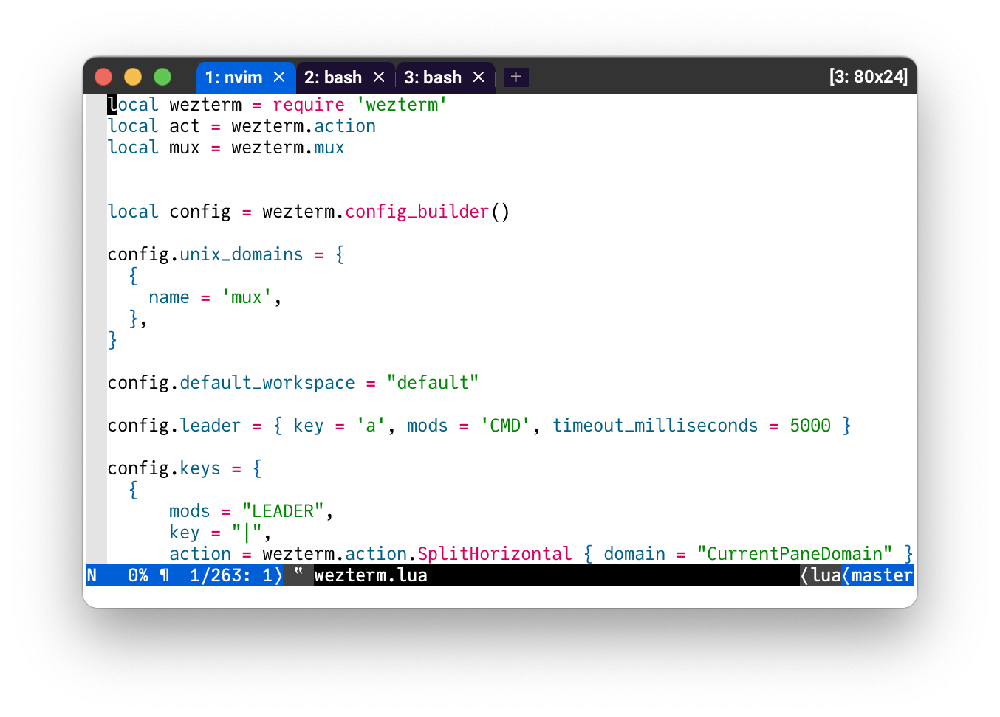

# My WezTerm Configuration

<p></p>

This repository contains my configuration files for [WezTerm](https://wezfurlong.org/wezterm/), running under macOS.

## Prerequisites

* [WezTerm 20240203-110809-5046fc22](https://wezfurlong.org/wezterm/changelog.html#20240203-110809-5046fc22)
* [JuliaMono font](https://juliamono.netlify.app)

## Installation

Make sure to have the [Prerequisites](#prerequisites) installed. The best way to install WezTerm on macOS is [via Homebrew](https://wezfurlong.org/wezterm/install/macos.html#homebrew).

To install the configuration, simply clone it into the appropriate configuration folder (typically, `$HOME/.config/`):

```
git clone git@github.com:goerz/wezterm-config.git ~/.config/wezterm
```

## Notable Features

* Light colorscheme. Contrary to current fashion, I do not use dark background terminals.

* Minimal UI for macOS. Combine buttons with tab bar ([`INTEGRATED_BUTTONS`](https://wezfurlong.org/wezterm/config/lua/config/window_decorations.html)).

* Show information about non-default workspace/domain, window ID, and terminal size in the tab bar.

* Leader key `CMD-a` ([screen](https://www.gnu.org/software/screen/) inspired), mainly used for interacting with workspaces/domains.

* Rename current tab with `CMD-r`.

* Interactively move panes/tabs to different windows with `CMD-SHIFT-t`.

* Interactively attach to domains with `LEADER a`.

* Show workspaces with `LEADER s`.

* Rename workspaces with `LEADER r`.

* Edit the config file with `CMD-,`.

* "Quick Edit" (open `EDITOR`) with `CMD-e`.

* Open a ChatGPT tab with `CMD-g`. This relies on my [NeoVim configuration](https://github.com/goerz/neovimrc) with the [gp.nvim](https://github.com/Robitx/gp.nvim) plugin.

* Toggle the tab bar with `LEADER t`. Useful as a "full screen mode" or for taking screenshots.


## Extras

### Custom Icon

The [default app icon isn't very pretty](https://github.com/wez/wezterm/discussions/2396). A better alternative is available at https://github.com/mikker/wezterm-icon. A copy of that repo is included here in the [`wezterm-icon` subfolder](wezterm-icon) for convenience. Just run `make install` there.

### NeoVim Wrapper

It turns out that WezTerm makes an excellent GUI wrapper for [NeoVim](https://github.com/neovim/neovim), filling a role similar to applications like [Neovide](https://neovide.dev). For this purpose, we use a separate configuration file:

* [`neovim.lua`](neovim.lua)

This assumes that `nvim` has been installed via `homebrew` and is available in `/opt/homebrew/bin/nvim`. It can be used by running the command

```
open -n -W -a /Applications/WezTerm.app --args --config-file $HOME/.config/wezterm/neovim.lua
```

via a [Shortcut](https://support.apple.com/guide/shortcuts-mac/intro-to-shortcuts-apdf22b0444c/mac), or some other method.

In this configuration, WezTerm tabs are disabled (in favor of NeoVim tabs). Most shortcuts are disabled, and the standard macOS shortcuts one would expect from a GUI editor are set up to interact with `neovim`.

The setup is intended to work with [my specific NeoVim configuration](https://github.com/goerz/neovimrc).

I'm also using the configuration as part of the (non-public) [Keyboard Maestro](https://www.keyboardmaestro.com/main/) macro that I extensively use in the web browser, where hitting `CMD-I` copies the content of the current text field, writes it to a file, opens NeoVim (wrapped in WezTerm) to edit that file, waits for the editor to close, reads the edited file content, switches back to the browser, and pastes the content into the text field.
